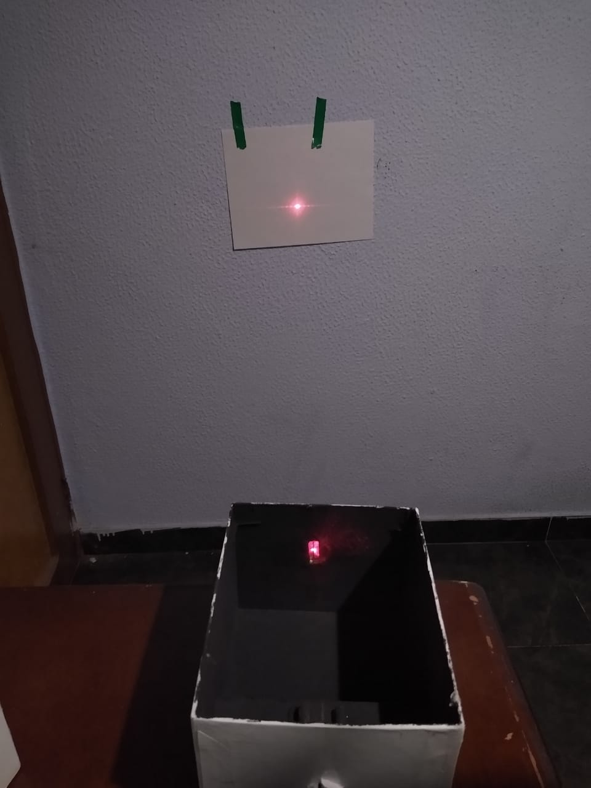

# Competencia_doble_rendija
### Presentado:
- Juan Pablo Nieto Cortes
### Asignatura
- CNYT
### Docente
- Luis Daniel Benavidez Navarro

# El experimento de la doble rendija 
# Objetivo
- Construir y verificar los resultados del experimento de la doble rendija.
## Historia
- El experimento de la doble rendija es un experimento realizado a principios del siglo XIX por el físico inglés Thomas Young, con el objetivo de apoyar la teoría de que la luz era una onda y rechazar la teoría de que la luz estaba formada por partículas.

- Young hizo pasar un haz de luz por dos rendijas y vio que sobre una pantalla se producía un patrón de interferencias, una serie de franjas brillantes y oscuras alternadas.

- Este resultado es inexplicable si la luz estuviera formada por partículas porque deberían observarse sólo dos franjas de luz frente a las rendijas, pero es fácilmente interpretable asumiendo que la luz es una onda y que sufre interferencias.

- Posteriormente este experimento se ha considerado en la física cuántica para demostrar el comportamiento ondulatorio de las partículas muy pequeñas, en la escala de los átomos.

- El experimento puede realizarse con electrones, átomos o neutrones, produciendo patrones de interferencia similares a los obtenidos cuando se realiza con luz. Esto muestra, por tanto, este comportamiento ondulatorio de las partículas.

## Teoria
- Tenemos un laser que dispara fotones atraves de dos rendijas.
- Nuevamente, supondremos que un fotón pasará a través de una de las dos rendijas. 
Cada rendija tiene un 50% de posibilidades de que el fotón la atraviese. A la derecha de 
cada ranura, hay tres dispositivos de medición. Se supone que se necesita un clic para 
ir del láser a la pared y un clic para ir de la pared a los dispositivos de medición. No nos 
interesa qué tan grandes son las rendijas o qué tan lejos están los dispositivos de 
medición de las rendijas.

- Tenemos que la probabilidad de que los fotones pasen por las dos rendijas es del 50%.
- Si sacamos la matris P de probabilidades y su modulo al cuadrado.

  

- No vemos nada extraño al tener un clic de transicion pero al tener dos clics de transicion.

 

- Notamos que al realizar dos clics de transicion la posicion 5 es igual a sero ya que si sumamos los numeros complejos.

- Por lo tanto notamos que habran sonas oscuras por que los fotones se cancelan en la posicion 5 y que estas sonas oscuras iran aumentando durante mas clics dando la señal de interferencia.

## Practico
Para realizar el experimento se debe seguir un procedimiento relativamente sencillo: Lo primero que se debe hacer es diseñar el número de rendijas que se quieren probar, esta puede ser de 1, 2, hasta el número que físicamente uno sea capaz de crear, el resultado en cada una de ellas deberia ser muy parecida si no es que el mismo.
Al ya tener las rendijas se crea una maqueta que tenga al fondo una pantalla para apreciar las imágenes que se generan en la pantalla se coloca la rendija que se quiere probar para el experimento, esta debe ser capaz de cambiar entre las rejillas y por último a una distancia que cuando se prenda el laser cubre completamente la rejilla y se genera la imagen en la pantalla.

# Materiales:
Para el experimento se requieren los siguientes materiales:
- Papel aluminio para crear las rendijas.
- Caja de cartón
- pintura negra
- Láser
- pelo
- aguja
- cinta

# Desarrollo:

Paso 1: Tomamos la caja y la pintamos de negro, después adaptamos para que tenga una ranura donde pase la luz de láser y podamos poner las rendijas.

Paso 2:Tomamos el aluminio y cortamos con una aguja para que de una sola rendija, después hacemos la división con un pelo para que tenga el menor grosor posible la doble rendija.

Paso 2.1: Tambien podemos hacer el experimento de interferencia circular haciendo dos punto pequeños en el papel aluminio con la aguja.

Paso 3: Buscamos una superficie plana la cual ver nuesto experimento.

Paso 4: ponemos las rendijas y comprobamos el resultado.

- montaje

- Doble rendija

- interferencia circular

# Video doble rendija
- https://youtu.be/KjiM0I0SN8c
# Interferencia Circular
- https://youtu.be/Ny7ZXV7CJkw
### Bibliografia
- Noson S. Yanofsky, Mirco A. Mannucci. Quantum Computing for Computer Scientists.
Cambridge University Press. 2013 (First published 2008)
- https://www.bbc.com/mundo/noticias-59563136#:~:text=El%20experimento%20de%20la%20doble%20rendija%20es%20un%20experimento%20realizado,luz%20estaba%20formada%20por%20part%C3%ADculas.